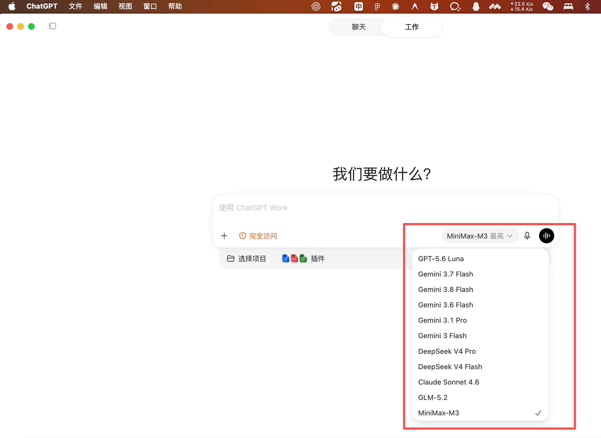
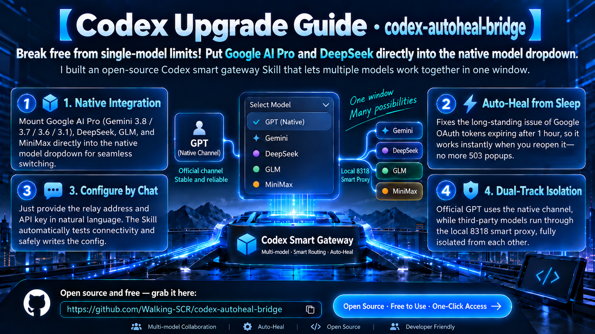

# codex自定义模型桥接 skill

[English](#english) | [中文说明](#中文说明)

---

## 中文说明

<p align="center">
  
</p>

### 📖 项目简介

**codex自定义模型桥接 skill**（Codex Autoheal Bridge）是专为 **Codex Desktop** 和 **Codex CLI** 打造的智能多模型共存网关。

它打破了 Codex Desktop 只能绑定单一大模型 Provider 的限制，**支持一键将任何自定义模型添加至 Codex / GPT App 原生的模型选择列表中**。用户无需切换账号或新建会话，即可在**同一个对话窗口中自由无缝切换官方原生 GPT 与任意自定义添加的模型**（例如上一句用 GPT-5.6 构思架构，下一句切 DeepSeek 敲具体代码，再下一句切 Gemini 3.8 分析超长文档）。

同时内置了**断网/休眠按需自愈引擎**，即便电脑合盖休眠数天，唤醒后点击发送依然能自动完成后台换票，彻底告别高频出现的 `503 auth_unavailable` 报错。

<p align="center">
  
</p>

---

### 🌟 核心特性

1. **原生模型下拉列表集成 & 会话内自由切换**直接无缝打通 Codex / GPT App 客户端的原生模型选择器。用户自定义添加的模型与官方 GPT 并列展示，支持在同一个会话内随时随心切换，共享可见上下文且互不干扰。
2. **一键添加新模型（自然语言 / CLI 命令防呆）**支持一键将任意带 API Key 的模型挂载到 Codex / GPT App 模型列表中。内置“双模真机连通性探针”与“37 字段 Rust 强类型深拷贝”，彻底避免手工修改 JSON 遗漏 `support_verbosity` 等必填字段引起的解析崩溃。
3. **双轨模型隔离（官方 GPT 绝不暴雷）**采用 8318 智能路由机制，`gpt-*` 和 `codex-*` 请求直接走官方通道，第三方模型（Gemini / Claude / DeepSeek）转发到 8317 本地代理。第三方服务或账号故障绝不影响官方 GPT 的正常使用。
4. **休眠/关机无感自愈（告别 503）**针对 Google OAuth 访问令牌（Access Token）仅 1 小时寿命的问题，8318 路由在请求进入时自动读取本地 6 个月有效的 Refresh Token，300 毫秒内静默向 Google 换取新票并同步，休眠醒来即用。
5. **刚唤醒网络重连容错**针对笔记本电脑开盖瞬间 Wi-Fi 正在重连的情况，内置 3 次网络自动重试机制，防止刚开机发消息由于断网而报错。
6. **跨模型上下文无缝切换**自动清洗跨 Provider 的加密思维链（Encrypted Reasoning）及 Response ID，避免在同一个会话中从 Gemini 切到 GPT 或 DeepSeek 时因内部格式不兼容而崩溃。
7. **非标 SSE 流结束符自动补齐（SSE Normalizer）**针对 MiniMax 等国产厂商在流式结束时不发送 `data: [DONE]` 导致 8317 误判断流报 503 的非标问题，8318 路由透明内置了流终结符补齐垫片，自动兼容所有非标中转站。
8. **开箱即用与纯本地安全**
   所有凭据与分流均在本地 `127.0.0.1` 环回接口运行，密钥和 OAuth 凭证不出本机。

---

### 🏗️ 架构拓扑

```text
                Codex Desktop 客户端
               (所有请求统一打到 8318)
                         │
                         ▼
            8318 智能路由 (Model Router & SSE Normalizer)
            ┌────────────┴────────────┐
            ▼                         ▼
    【GPT / Codex 官方模型】      【第三方外部模型】
    直连 OpenAI 官方服务器       转发到 8317 CLIProxyAPI
    (原汁原味，永远不挂)        (支持休眠唤醒自动换票续期)
                                  ├─ Google AI Pro 额度 (Antigravity OAuth)
                                  ├─ DeepSeek 官方直连 (API Key)
                                  └─ 中转站 / 其它厂商 (GLM, MiniMax, Qwen...)
```

---

### 📦 一键安装当前 Skill

将本 Skill 安装到你的 Codex 环境中有两种极简方式：

#### 方式一：在 Codex Desktop 中使用 `$skill-installer` 一键安装（推荐）

在 Codex 任意对话框中发送下面这句话即可自动完成安装：

> “使用 `$skill-installer` 帮我从 GitHub 安装技能：`https://github.com/<your-username>/codex-autoheal-bridge`”

*(说明：安装完成后，Codex 会在下一轮对话中自动识别并提供 `$codex-autoheal-bridge` 技能)*

#### 方式二：在终端使用 Git 一行命令安装

直接克隆到本地 Codex 技能目录（`~/.codex/skills`）：

```bash
git clone https://github.com/<your-username>/codex-autoheal-bridge.git ~/.codex/skills/codex-autoheal-bridge
```

*(如果没有安装 git，也可以下载 zip 解压后将整个文件夹命名为 `codex-autoheal-bridge` 并放进 `~/.codex/skills/` 目录)*

---

### ⚡ 一键极简自动化配置（最省心推荐）

如果你不想手动编辑配置文件和排错，可以使用本项目提供的**全自动一键配置**能力：

#### 选项 A：在 Codex 中用自然语言一键完成（推荐）

在 Codex Desktop 任何会话中，直接发送下面任意一句话即可**100% 自动触发 Skill 执行**：

> **推荐话术 1（全套多模型一键接入）**：
> “使用 `$codex-autoheal-bridge` 帮我一键配置并启用多模型共存网关”
>
> **推荐话术 2（专配 Google AI Pro 额度）**：
> “使用 `$codex-autoheal-bridge` 帮我一键配置 Google AI Pro (Gemini 3.8/3.7/3.6/3.1) 系列模型接入”

*(触发机制说明：只要在你的输入中包含 `$codex-autoheal-bridge` 标签，Codex 调度器就会必定激活本 Skill。Skill 启动时会**首先提示你确认当前操作系统（macOS / Windows）**，确认后自动执行环境审计、部署对应系统的无感后台自愈网关并安全写入配置。完成后只需重启 Codex Desktop 即可直接使用！)*

#### 选项 B：在终端运行一行命令一键配置

**macOS 环境：**
```bash
python3 ~/.codex/skills/codex-autoheal-bridge/scripts/bridge.py configure-desktop --platform darwin --apply
```

**Windows 环境：**
```bash
python %USERPROFILE%\.codex\skills\codex-autoheal-bridge\scripts\bridge.py configure-desktop --platform windows --apply
```

该命令会自动完成跨平台无感常驻：

1. **操作系统自适应**：macOS 自动注册 `LaunchAgent` 系统守护；Windows 自动生成无黑框静默运行脚本（`run-router-hidden.vbs`）并写入开机自启目录（`Startup`），彻底杜绝控制台黑框闪烁与误关；
2. **环境校验**：校验账号与历史会话完整性，确保官方 GPT 历史不丢失；
3. **自愈网关部署**：安装 8318 自愈路由器并自动启动；
4. **安全配置写入**：安全备份并在 `config.toml` 中配置好路由地址与原生模型目录；
5. **连通性验收**：自动完成双模探针与连通性测试。

完成后重启 Codex Desktop 即可生效。

---

### ➕ 一键添加任意 API Key 新模型

支持接入任何兼容 OpenAI 协议的大模型（如 MiniMax、智谱 GLM、通义千问 Qwen、月之暗面 Kimi 以及各大中转站）。

#### 方式一：在 Codex 中通过自然语言一键添加（最省心推荐）

直接在 Codex Desktop 对话框中把模型信息发给它，**只要包含三要素（模型名称、接口地址、API Key）**，Skill 就会自动完成双模连通性探针测试、深拷贝生成包含 37 个严格字段的模型目录并热重载：

**📋 推荐提示词话术模板：**

> 使用 `$codex-autoheal-bridge` 帮我添加一个新模型：
>
> - **模型名称**：`<模型ID，例如 MiniMax-M3 或 glm-5.2>`
> - **接口地址**：`<Base URL 或完整接口地址，例如 https://api.minimaxi.com/v1>`
> - **API Key**：`<你的 API Key，例如 sk-...>`
> - **显示名称**（可选）：`<下拉菜单中希望展示的名字>`

**💡 格式要求与智能容错说明：**

1. **模型名称**：必须与服务商文档完全一致（如 `MiniMax-M3`、`glm-5.2`、`qwen-2.5-coder-32b`）；
2. **接口地址**：支持填入基础 Base URL（如 `https://api.xxx.com/v1`），即使误填了 `/chat/completions` 或 `/anthropic`，Skill 也会自动智能识别并纠正为标准端点；
3. **API Key**：必须真实有效且账户有余额。Skill 会在写入配置前自动发起真实流式测试，通过后才允许写入，防止坏配置导致系统报错；
4. **自动流规范化**：如果检测到厂商（如 MiniMax）在流式结束时偷懒漏发 `[DONE]` 标志，Skill 会全自动为其挂载 8318 的流终结符补齐垫片，彻底消除 503 报错。

**真实自然语言示例：**

> “使用 `$codex-autoheal-bridge` 帮我把这个中转站的模型加进下拉菜单：地址是 https://api.your-relay-service.com/v1/chat/completions，模型名是 glm-5.2，key 是 <你的API_KEY>，确保不要动其他模型。”

---

#### 方式二：在终端使用 CLI 一行命令添加

```bash
# 格式：
python3 ~/.codex/skills/codex-autoheal-bridge/scripts/bridge.py add-model \
  --model "<模型实际名称>" \
  --base-url "<接口Base URL>" \
  --api-key "<API Key>" \
  --display-name "<下拉菜单显示的名称>" \
  --apply

# 示例 1：添加智谱 GLM-5.2
python3 ~/.codex/skills/codex-autoheal-bridge/scripts/bridge.py add-model \
  --model "glm-5.2" \
  --base-url "https://api.your-relay-service.com/v1" \
  --api-key "sk-..." \
  --apply

# 示例 2：添加 MiniMax-M3（自动纠错并挂载流式补齐垫片）
python3 ~/.codex/skills/codex-autoheal-bridge/scripts/bridge.py add-model \
  --model "MiniMax-M3" \
  --base-url "https://api.minimaxi.com/v1" \
  --api-key "sk-cp-..." \
  --apply
```

查看当前所有已配置的模型状态：

```bash
python3 ~/.codex/skills/codex-autoheal-bridge/scripts/bridge.py list-models
```

---

### 🛠️ 手动分步配置（进阶/排查备用）

如果你希望完全手动掌控每个环节，可以对照以下步骤逐一配置：

#### 步骤 1：配置 8317 (CLIProxyAPI)

编辑 `~/.cli-proxy-api/config.yaml` 配置基础端口与 DeepSeek 密钥：

```yaml
host: "127.0.0.1"
port: 8317
auth-dir: "~/.cli-proxy-api"
api-keys:
  - "sk-your-custom-proxy-key"

openai-compatibility:
  - name: "deepseek"
    base-url: "https://api.deepseek.com/v1"
    api-key-entries:
      - api-key: "你的DeepSeek_API_KEY"
    models:
      - name: "deepseek-chat"
        alias: "deepseek-v4-flash"
      - name: "deepseek-reasoner"
        alias: "deepseek-v4-pro"
```

完成首次 Antigravity 登录（仅需一次）：

```bash
cli-proxy-api -config ~/.cli-proxy-api/config.yaml -antigravity-login
```

#### 步骤 2：启动开机常驻守护服务 (macOS LaunchAgent)

```bash
launchctl bootstrap gui/$(id -u) ~/Library/LaunchAgents/com.zhijian.codex-cli-model-bridge-cliproxyapi.plist
launchctl bootstrap gui/$(id -u) ~/Library/LaunchAgents/com.zhijian.codex-cli-model-bridge-router.plist
```

*(注意：若存在旧版 `transparent-proxy` 服务，请彻底将其 `bootout` 停用)*

#### 步骤 3：配置 Codex Desktop 主设置

在 `~/.codex/config.toml` 中添加：

```toml
model_provider = "openai"
openai_base_url = "http://127.0.0.1:8318/v1"
model_catalog_json = "~/.codex/model-catalog-cli-proxy.json"
```

#### 步骤 4：完全重启 Codex Desktop

按快捷键 `Cmd + Q` 彻底退出软件并重新打开，点击输入框下方的模型选择器，即可自由选择所有模型！

---

### 🛠️ 故障排查（FAQ）

| 报错信息                                     | 真实原因                                                   | 解决方式                                                                      |
| :------------------------------------------- | :--------------------------------------------------------- | :---------------------------------------------------------------------------- |
| `503 auth_unavailable`                     | 本地 Token 过期且未触发自愈                                | 8318 路由现已自动静默处理；若授权被手动撤销，重新运行一次登录命令即可         |
| `503 upstream stream closed before [DONE]` | 厂商流式结束未发`[DONE]` 终结符（如 MiniMax）            | 8318 已内置`__sse_shim` 垫片透明补齐，通过 `add-model` 即可自动识别并挂载 |
| `missing field support_verbosity`          | 手动修改模型目录时遗漏了 Rust 强类型必填字段               | 使用`bridge.py add-model` 自动深拷贝生成，杜绝手动修改 JSON 出错            |
| `503 MODEL_CAPACITY_EXHAUSTED`             | Google Antigravity 服务端模型配额暂时满载（多见于 Claude） | 属于云端服务器暂时排队，本地配置完好，换用 Gemini 即可                        |
| `502 ECONNREFUSED`                         | 8317 或 8318 本地端口未启动                                | 检查 LaunchAgent 运行状态或日志                                               |

---

### 📄 开源许可与致谢 (License)

本项目遵循 [MIT License](LICENSE)。本项目基于 [Luis Pater / Router-For.ME](https://github.com/router-for-me/CLIProxyAPI) 以及 [Zhijian AI](https://github.com/zjp1997720) 的开源研究与基础架构进行重构与增强，特别感谢开源社区对本地模型桥接领域的贡献。

> **免责声明**：OpenAI, GPT, Google, Gemini, Anthropic, Claude, DeepSeek 等名称与商标归其各自版权方所有。本项目仅用于个人学习研究与本地开发效率提升。

---

## English

<p align="center">
  
</p>

### 📖 Overview

**Codex Autoheal Bridge** is an intelligent, self-healing multi-model gateway designed specifically for **Codex Desktop** and **Codex CLI**.

It overcomes the limitation of Codex Desktop being locked into a single model provider, enabling users to **one-click add any custom model directly into the native model picker dropdown of Codex / GPT App**. Users can **freely switch between official native GPT models and any custom added models within the very same ongoing conversation** (e.g. brainstorming with GPT-5.6, writing implementation with DeepSeek, and analyzing long contexts with Gemini 3.8).

It features an **on-demand OAuth self-healing engine**: even if your computer stays asleep or powered off for days, the gateway automatically and silently refreshes expired tokens within 300ms upon waking, eliminating the notorious `503 auth_unavailable` error.

<p align="center">
  
</p>

---

### 🌟 Key Highlights

1. **Native Model Dropdown Integration & In-Chat Free Switching**Directly integrates into the Codex / GPT App UI model dropdown. Custom models sit side-by-side with official GPT models, allowing effortless switching at any point in a chat while preserving conversation context.
2. **One-Click Model Addition (Natural Language / CLI)**Add any external API Key model to the Codex / GPT App list in seconds. Features automated dual-mode preflight live connectivity probe and 37-field Rust serde strict schema deep-copy to completely avoid JSON deserialization errors.
3. **Dual-Track Isolation (Zero GPT Impact)**The 8318 Router directly routes `gpt-*` and `codex-*` traffic to OpenAI Native endpoints. Third-party models go to the local 8317 CLIProxyAPI. Failures in third-party providers never affect official GPT models.
4. **On-Demand Sleep/Wake Auto-Renewal**While Google OAuth access tokens expire in 1 hour, the 8318 Router silently exchanges the 6-month persistent refresh token for a new access token within 300ms before dispatching requests.
5. **Wi-Fi Reconnection Retries**Includes 3-attempt exponential network retry handling for moments right after laptop lid opening when Wi-Fi is still reconnecting.
6. **Encrypted Reasoning Scrubbing**Automatically scrubs cross-provider encrypted reasoning blobs and response IDs when switching models inside the same thread, preventing schema incompatibilities.
7. **Non-Standard SSE Stream Normalizer (`__sse_shim`)**Automatically detects and normalizes non-compliant upstream providers (such as MiniMax) that close SSE streams without `data: [DONE]`, seamlessly preventing gateway 503 interruptions.
8. **100% Local & Private**
   All traffic routing and credential storage reside on `127.0.0.1`.

---

### 🏗️ Architecture

```text
                Codex Desktop App
            (Unified baseURL: 127.0.0.1:8318)
                         │
                         ▼
           8318 Model-Aware Router & SSE Normalizer
            ┌────────────┴────────────┐
            ▼                         ▼
    【Native GPT / Codex】        【Third-Party Models】
    Direct to OpenAI Native       Forward to 8317 CLIProxyAPI
    (chatgpt.com/backend-api)     (With on-demand token renewal)
                                      ├─ Google AI Pro (Antigravity OAuth)
                                      ├─ DeepSeek Official API (API Key)
                                      └─ Relay / Custom APIs (MiniMax, GLM...)
```

---

### 📦 One-Click Skill Installation

You can install this skill into your local Codex environment via either of the following methods:

#### Method 1: Using `$skill-installer` inside Codex (Recommended)

Send the following prompt in any Codex Desktop task:

> "Use `$skill-installer` to install this skill from GitHub: `https://github.com/<your-username>/codex-autoheal-bridge`"

#### Method 2: One-Line Terminal Git Clone

Clone directly into your local Codex skills directory (`~/.codex/skills`):

```bash
git clone https://github.com/<your-username>/codex-autoheal-bridge.git ~/.codex/skills/codex-autoheal-bridge
```

---

### ⚡ One-Click Automated Setup (Recommended)

#### Option A: Natural Language inside Codex

Simply send either of the following prompts in any Codex Desktop task to trigger the skill automatically:

> "Use $codex-autoheal-bridge to automatically configure and enable the multi-model gateway."
>
> *(Or specifically for Google AI Pro)*:
> "Use $codex-autoheal-bridge to configure Google AI Pro (Gemini 3.8/3.7/3.6/3.1) models into Codex."

#### Option B: One-Line Terminal Command

```bash
python3 ~/.codex/skills/codex-autoheal-bridge/scripts/bridge.py configure-desktop --apply
```

This command automatically:

1. Verifies existing account continuity and thread history integrity;
2. Generates and loads `com.zhijian.codex-cli-model-bridge-router.plist` launch agent;
3. Automatically unloads legacy transparent proxy if present;
4. Atomically updates `~/.codex/config.toml` with `openai_base_url` and verified model catalog;
5. Runs health preflight probes.

Finally restart Codex Desktop (`Cmd + Q`).

---

### ➕ One-Click Add New Models

#### Method 1: Natural Language inside Codex

Provide the 3 required fields in a prompt:

> "Use $codex-autoheal-bridge to add a new model:
>
> - Model ID: MiniMax-M3
> - Base URL: https://api.minimaxi.com/v1
> - API Key: sk-cp-..."

#### Method 2: Terminal CLI

```bash
python3 ~/.codex/skills/codex-autoheal-bridge/scripts/bridge.py add-model \
  --model "<model_id>" \
  --base-url "<endpoint_base_url>" \
  --api-key "<api_key>" \
  --display-name "<dropdown_label>" \
  --apply
```

---

### 📄 License & Attribution

Distributed under the [MIT License](LICENSE).Built upon initial foundations by [Luis Pater / Router-For.ME](https://github.com/router-for-me/CLIProxyAPI) and [Zhijian AI](https://github.com/zjp1997720).

> **Disclaimer**: All product names, logos, and brands (OpenAI, GPT, Google, Gemini, Anthropic, Claude, DeepSeek) are property of their respective owners.
